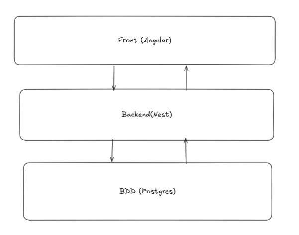

# Sportify Pro

Application de gestion de séances de coaching sportif. Un client peut consulter les séances disponibles, les réserver et les annuler. Les coachs gèrent leurs séances et consultent leurs participants. Les administrateurs supervisent l'ensemble des utilisateurs, séances et réservations.

- **Backend** : `sportify-api/` — API REST NestJS 11, PostgreSQL 16, Prisma 6, JWT
- **Frontend** : `sportify-front/` — Angular 21, composants standalone, signals


---

## Démarrage rapide — Docker

**Prérequis** : Docker Desktop installé et démarré.

```bash
docker compose up --build
```

| Service   | URL                                  |
|-----------|--------------------------------------|
| Frontend  | http://localhost:4200                |
| API       | http://localhost:3000                |
| Swagger   | http://localhost:3000/api/docs       |

La base de données est automatiquement migrée et alimentée avec des comptes de démonstration au premier démarrage.

**Comptes de démonstration :**

| Rôle   | Email                  | Mot de passe  |
|--------|------------------------|---------------|
| ADMIN  | admin@sportify.fr      | Password123!  |
| COACH  | coach@sportify.fr      | Password123!  |
| CLIENT | client@sportify.fr     | Password123!  |

> Le seed utilise `upsert` — relancer `docker compose up` ne crée pas de doublons.

---

## Développement local

**Prérequis** : Node.js 20+, Docker (pour PostgreSQL).

### 1. Base de données

```bash
cd sportify-api
docker compose up -d        # lance PostgreSQL 16 uniquement
cp .env.example .env        # à remplir si besoin (valeurs par défaut fonctionnelles)
npm install
npm run prisma:migrate      # applique la migration initiale
npm run seed                # insère les comptes et séances de démo
```

### 2. Backend

```bash
cd sportify-api
npm run start:dev           # http://localhost:3000 avec rechargement automatique
```

### 3. Frontend

```bash
cd sportify-front
npm install
npm start                   # http://localhost:4200 avec rechargement automatique
```

---

## Tests

### Lancer les tests manuellement

Backend (29 tests Jest) :

```bash
cd sportify-api
npm test -- --runInBand
```

Frontend (2 tests Vitest) :

```bash
cd sportify-front
npm test -- --watch=false
```

### Hook pre-commit — CI local (bonus)

Les tests backend et frontend sont automatiquement exécutés avant chaque `git commit`. Si un test échoue, le commit est bloqué.

Le hook est versionné dans `.githooks/pre-commit`. Pour l'activer sur une nouvelle machine :

```bash
git config core.hooksPath .githooks
```

---

## Fonctionnalités

### Fonctionnalités principales

- Authentification JWT (inscription, connexion, profil).
- Gestion des rôles `ADMIN`, `COACH`, `CLIENT`.
- CRUD des séances d'entraînement (coach/admin).
- Réservation et annulation de séances (client).
- Vérification de capacité maximale et de conflits horaires.
- Supervision complète en tant qu'administrateur.
- Documentation Swagger interactive.

### Bonus réalisés

- Recherche par titre et filtre par plage de dates sur la liste des séances.
- Pagination des résultats.
- Interface responsive (mobile-friendly).
- **Hook pre-commit** : exécution automatique des tests avant chaque commit.

---

## Livrables de conception

| Fichier                           | Contenu                                |
|-----------------------------------|----------------------------------------|
| `USER_STORIES.md`                 | User stories US-001 à US-023           |
| `Sportify Wireframes.html`        | Maquettes de l'interface               |
| `MCD.loo`                         | Modèle Conceptuel de Données (Looping) |
| `diagramme_utilisation.drawio.png`| Diagramme de cas d'utilisation         |
| `CHECKLIST.MD`                    | Suivi des livrables d'examen           |

---

## Architecture

L'application suit une architecture 3 tiers :

- **Présentation** : Angular 21 dans `sportify-front/` — composants standalone, Angular signals, lazy loading, intercepteurs HTTP.
- **Métier / API** : NestJS 11 dans `sportify-api/` — controllers → services → Prisma, guards JWT et rôles.
- **Données** : PostgreSQL 16 piloté par Prisma 6, UUID comme clé primaire.

### Modèle de données

Trois entités principales :

- `User` — rôle `ADMIN | COACH | CLIENT`, mot de passe hashé bcrypt.
- `Session` — séance rattachée à un coach, avec capacité maximale.
- `Reservation` — contrainte d'unicité user/session, statut `CONFIRMED | CANCELLED`.

### Choix techniques

| Besoin                        | Choix                          | Raison                                                   |
|-------------------------------|--------------------------------|----------------------------------------------------------|
| Framework API                 | NestJS 11                      | Structure modulaire adaptée aux APIs REST avec IoC       |
| ORM                           | Prisma 6                       | Typage fort, migrations SQL versionées                   |
| Base de données               | PostgreSQL 16                  | Contraintes relationnelles entre users, séances, réservations |
| Authentification              | JWT Bearer (1 jour)            | Stateless, compatible SPA Angular                        |
| Framework frontend            | Angular 21 standalone          | Composants sans NgModule, signals pour l'état local      |
| Documentation API             | Swagger / OpenAPI              | Interface de test intégrée                               |
| Conteneurisation              | Docker Compose                 | Démarrage de la stack complète en une commande           |
